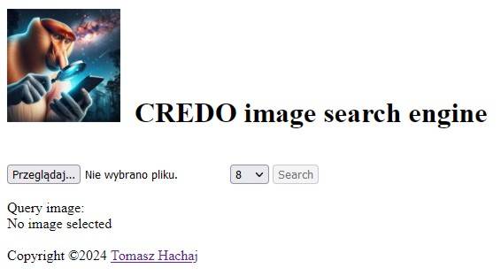
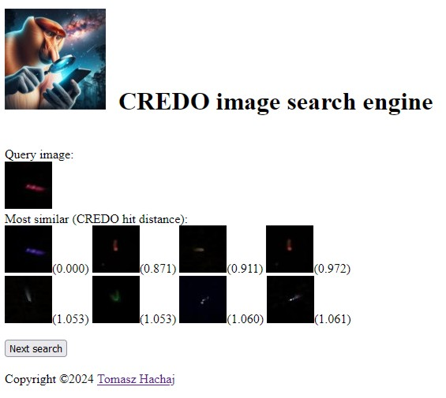

### CREDO image search engine

Engine that finds the most similar images to a given query [CREDO](https://credo.science/) CMOS image.

Python / Flask implementation of an algorithm:

Piekarczyk, M.; Hachaj, T. On the Search for Potentially Anomalous Traces of Cosmic Ray Particles in Images Acquired by Cmos Detectors for a Continuous Stream of Emerging Observational Data. Sensors 2024, 24, 1835. https://doi.org/10.3390/s24061835 

Author: [Tomasz Hachaj](https://home.agh.edu.pl/~thachaj/)

## Setup

1 Download embedding [embedding.npy (271.4MB)](https://drive.google.com/file/d/1FVGa3gGYjr_Mx2o_nibBr9bgU_ZIizQV/view?usp=sharing) and put in in the [data](data/) directory. 

2 Download CREDO dataset [CREDO dataset (1014MB)](https://drive.google.com/file/d/1jSuQXfxFzWsFoTEYDno1V_Aqn5AaNs_I/view) and set path to  in file [test.py](test.py) by assigning variable:

```
path_to_data = 'd:/Directory_with_credo_dataset'
```

## Using the app

1 Entry points are in file [test.py](test.py)

2 Open website in browser, select a \*.png file (query image) with hit data, select number of similar images to find and click Search button.



3 You should be redirected to website that shows most similar images and distance in embedding space between query image and results. You can return to previous page by clicking Next search button.



## Creating new embedding

In order to create new embedding (for example after updating dataset) use source code from repository [anomalies_bigdata](https://github.com/browarsoftware/anomalies_bigdata) to generate new embedding of dataset, V matrix and "mean face". Than limit the size of embedding and V with [export_data_from_numpy.py](export_data_from_numpy.py). New files have to be put in [data](data/) directory. You can also export \*.json data with [export_data_from_json.py](export_data_from_json.py).

## Have a nice search! =o)

